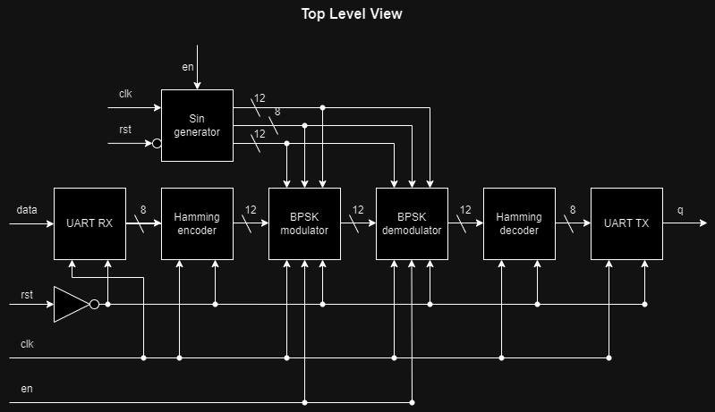

# Usage

## Dependencies 

`hdlmake`, `make`, `cocotb`, `pytest`, `vivado`, `modelsim`, `python`, `chocolatey`, `winget`

## Installation

### Download python and git:
- [Install Chocolatey on Windows 10](https://gist.github.com/lopezjurip/2a188c90284bf239197b)

### Clone repository:
```bash
git clone --recurse-submodules https://github.com/RDSik/verilog-transceiver.git
cd verilog-transceiver
```

### Download packages:
```bash
pip install six
pip install hdlmake
pip install cocotb
pip install pytest
```

### Download make (add to PATH system variable the Make bin folder: C:\Program Files (x86)\GnuWin32\bin):
```bash
winget install GnuWin32.make
```

## Build project

### Build trasceiver:
```bash
cd syn
hdlmake
make
```

### Build only vivado project:
```bash
cd syn
hdlmake
make project
```

## Simulation

### Vivado simulation using hdlmake:
```bash
cd sim/vivado
hdlmake
make
```

### Icarus simulation using cocotb:
```bash
py -m venv myenv
.\myenv\Scripts\activate.ps1
cd .\sim\cocotb\icarus
py -m pytest test.py
gtkwave .\sim_build_transceiver\transceiver_top.vcd
deactivate
```

### Modelsim simulation

#### Using cocotb (with 64 bit Python use 64 bit Modelsim):
```bash
py -m venv myenv
.\myenv\Scripts\activate.ps1
cd .\sim\cocotb\modelsim
py -m pytest test.py
deactivate
```

#### Using hdlmake:
```bash
cd sim/modelsim
hdlmake
make
```
