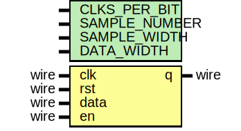

# Entity: transceiver_top 
- **File**: transceiver_top.v
- **Title:**  digital_transceiver module design
- **Author:**  Dmitry Ryabikov

## Diagram

## Description

## Generics

| Generic name  | Type | Value             | Description                                                                                |
| ------------- | ---- | ----------------- | ------------------------------------------------------------------------------------------ |
| CLKS_PER_BIT  |      | 1_000_000/115_200 | 1 MHz (1 MHz for simulation for normal working on board swith to 100 MHz) and 115_200 Baud |
| SAMPLE_NUMBER |      | 256               | numbers of sample in one sine period                                                       |
| SAMPLE_WIDTH  |      | 12                | sample width                                                                               |
| DATA_WIDTH    |      | 12                | data width                                                                                 |
| SIN_VALUE     |      | "sin_val.dat"     | dat file with sine samples                                                                 |
| NEG_SIN_VALUE |      | "neg_sin_val.dat" | dat file with negative sine samples                                                        |

## Ports

| Port name | Direction | Type | Description                         |
| --------- | --------- | ---- | ----------------------------------- |
| clk       | input     | wire | clock  input (100 MHz)              |
| arstn     | input     | wire | asynchronous reset input (negative) |
| data      | input     | wire | data   input                        |
| en        | input     | wire | enable input                        |
| q         | output    | wire | quit   output                       |

## Signals

| Name            | Type                             | Description                                        |
| --------------- | -------------------------------- | -------------------------------------------------- |
| done            | wire                             | uart transmit done output                          |
| active          | wire                             | uart transmit active output                        |
| data_valid      | wire                             | uart transmit data valid output                    |
| uart_rx_out     | wire [7:0]                       | uart receive instance output                       |
| decoder_out     | wire [7:0]                       | hamming decoder instance output                    |
| encoder_out     | wire [DATA_WIDTH-1:0]            | hamming encoder instance output                    |
| cnt_out         | wire [$clog2(SAMPLE_NUMBER)-1:0] | sine generator counter output                      |
| demodulator_out | wire [DATA_WIDTH-1:0]            | binary phase shift key demodulator instance output |
| modulator_out   | wire [SAMPLE_WIDTH-1:0]          | binary phase shift key modulator instance output   |
| neg_sin_out     | wire [SAMPLE_WIDTH-1:0]          | negative sine generator output                     |
| sin_out         | wire [SAMPLE_WIDTH-1:0]          | sine generator output                              |

## Instantiations

- uart_rx_inst: UART_RX
  - uart receive instance
- encoder_inst: hamming_encoder
  - hamming encoder instance
- sin_generator_inst: sin_generator
  - sine generator instance (generate sine and negative sine sample from .dat files using a counter)
- bpsk_modulator_inst: bpsk_modulator
  - binary phase shift key modulator instance
- bpsk_demodulator_inst: bpsk_demodulator
  - binary phase shift key demodulator instance
- decoder_inst: hamming_decoder
  - hamming decoder instance
- uart_tx_inst: UART_TX
  - uart transmit instance